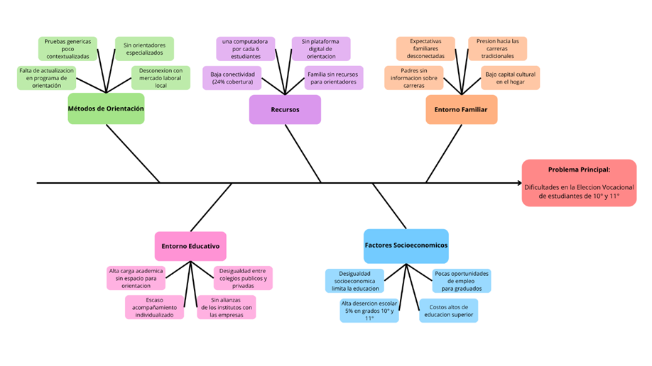

# Espina de Pescado (Ishikawa)

**Problema principal:**

Dificultades en la elección vocacional de estudiantes de grados décimo y once en instituciones educativas públicas de Medellín (lo cual incide en la deserción escolar y en la baja preparación para el mercado laboral).

**Categorías principales de causas (ramas):**

**1. Métodos de orientación (Procesos):**
   - Falta de actualización en los programas de orientación vocacional.
   - Uso de pruebas genéricas poco contextualizadas.
   - Limitada participación de orientadores especializados.
   - Escasa relación entre los programas y las tendencias del mercado laboral local.

**2. Recursos (Materiales y tecnología):**
   - Baja conectividad a Internet en colegios públicos (solo 24 % de cobertura en Medellín).
   - Falta de acceso a computadores (1 por cada 6 estudiantes).
   - Escasez de plataformas digitales accesibles para orientación vocacional.
   - Recursos económicos limitados de las familias para pagar asesorías externas.

**3.	Entorno familiar (Personas):**
   - Padres con poca información sobre carreras y mercado laboral.
   - Expectativas familiares desconectadas de los intereses del estudiante.
   - Presión social hacia carreras tradicionales (derecho, medicina, ingeniería).
   - Bajo capital cultural y educativo en algunos hogares.

**4.	Entorno educativo (Instituciones):**
   - Alta carga académica que reduce espacios para orientación vocacional.
   - Escaso acompañamiento individualizado.
    - Falta de alianzas colegio–universidad–empresa.
   - Desigualdades entre colegios públicos y privados.

**5.	Factores sociales y económicos (Contexto):**
   - Desigualdad socioeconómica en Medellín que limita la continuidad educativa.
   - Alta deserción escolar en grados décimo y once (5 % en 2023).
   - Dificultad de acceso a educación superior por costos.
   - Pocas oportunidades laborales claras para bachilleres.

  

