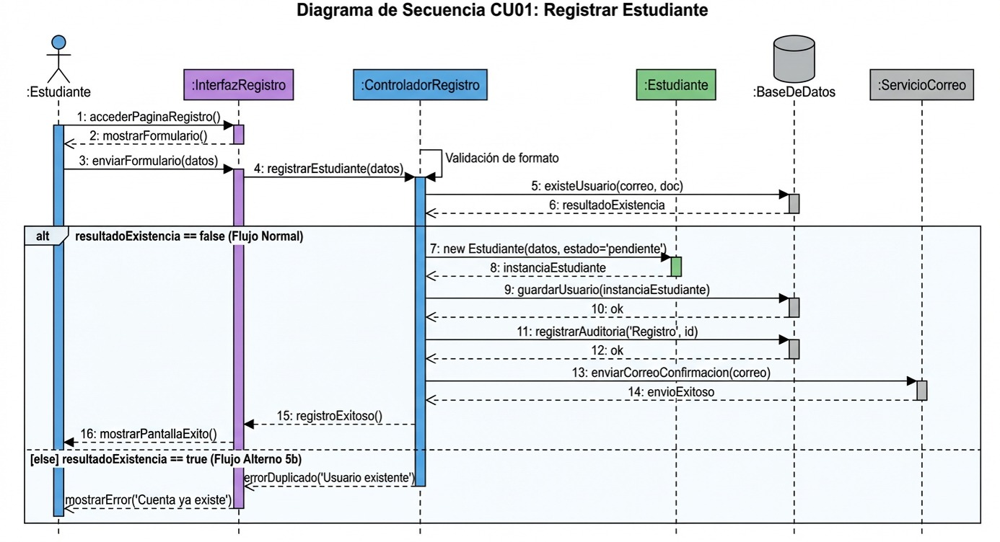
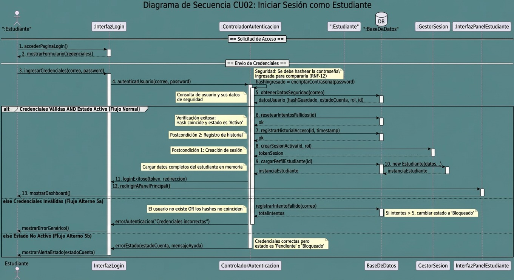
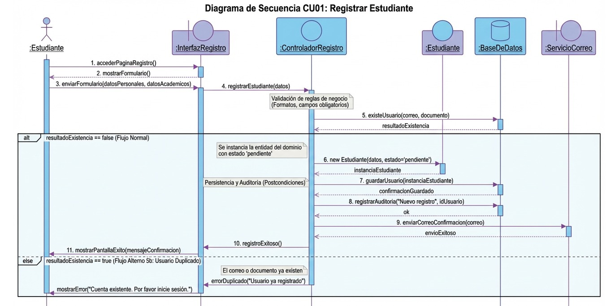
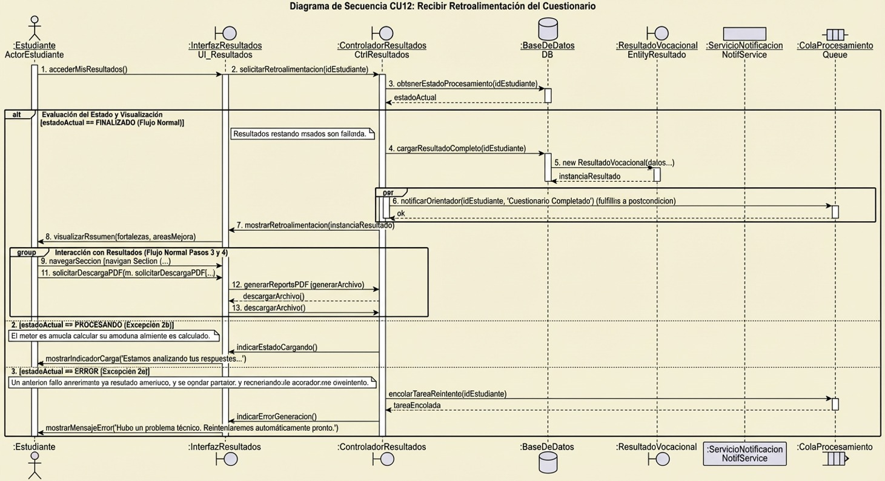

# Diagrama de Secuencia

Interpretación del Diagrama
Inicio: El estudiante solicita la página y el sistema le muestra el formulario.
Envío: El estudiante envía sus datos. La: InterfazRegistro delega la responsabilidad al: ControladorRegistro.
Validación y Bifurcación (Alt):
El controlador primero valida formatos internamente.
Luego, consulta a la: BaseDeDatos si el usuario ya existe (mensaje 5).
El bloque alt maneja la respuesta de la base de datos.
Camino del "else" (Flujo Alterno 5b): Si la base de datos dice true (existe), el controlador devuelve un error a la interfaz, y esta muestra un mensaje al usuario sugiriendo iniciar sesión.
Camino del "if" (Flujo Normal): Si la base de datos dice false (no existe):
Se crea la instancia de la entidad: Estudiante en memoria (mensaje 6).
Se guarda esta entidad en la: BaseDeDatos (mensaje 7).
Se cumple la postcondición de registrar auditoría (mensaje 8).
Se solicita al: ServicioCorreo enviar el email (mensaje 9).
Finalmente, se retorna el éxito a la interfaz para que redirija al usuario (mensajes 10 y 11).
CU01 – Registrar Estudiante

Por qué es clave:
Es la puerta de entrada al sistema
Involucra validaciones, BD y notificaciones
Perfecto para secuencia (formulario → validación → persistencia → correo)
Ideal para diagrama de secuencia porque incluye:
Actor (Estudiante)
Sistema
Base de datos
Servicio de correo

  

Interpretación del Diagrama
Inicio: El estudiante ingresa sus datos en la interfaz de login.
Procesamiento Seguro: El :ControladorAutenticacion recibe la contraseña en texto plano y, crucialmente, la encripta (hashea) antes de hacer cualquier comparación, cumpliendo con los requisitos de seguridad.
Consulta: Se piden a la base de datos los datos de seguridad del usuario asociado a ese correo (su hash guardado y su estado).
Bifurcación (Alt):
Flujo Normal (Éxito): Si el hash calculado coincide con el hash guardado en la BD Y el estado de la cuenta es "Activo". Se procede a resetear contadores de intentos fallidos, registrar el acceso (auditoría), crear la sesión en el :GestorSesion, cargar la entidad :Estudiante en memoria y redirigir al dashboard.
Flujo 5a (Fallo Credenciales): Si no coinciden los hashes o el usuario no existe. Se registra el intento fallido en la BD (que podría desencadenar un bloqueo si supera el límite) y se retorna un error genérico a la UI para no dar pistas a atacantes.
Flujo 5b (Fallo Estado): Si las credenciales son correctas pero la cuenta no está activa (ej. falta validar el correo o está bloqueada por intentos previos). Se informa a la UI el estado específico para mostrar el mensaje de ayuda correspondiente.
CU02 – Iniciar Sesión como Estudiante

Por qué es clave:
Maneja autenticación (crítica en cualquier sistema)
Tiene validaciones, control de errores y seguridad
Incluye:
Validación de credenciales
Manejo de intentos fallidos
Creación de sesión

  

Interpretación del Diagrama
Inicio: El estudiante solicita la página y el sistema le muestra el formulario.
Envío: El estudiante envía sus datos. La :InterfazRegistro delega la responsabilidad al :ControladorRegistro.
Validación y Bifurcación (Alt):
El controlador primero valida formatos internamente.
Luego, consulta a la :BaseDeDatos si el usuario ya existe (mensaje 5).
El bloque alt maneja la respuesta de la base de datos.
Camino del "else" (Flujo Alterno 5b): Si la base de datos dice true (existe), el controlador devuelve un error a la interfaz, y esta muestra un mensaje al usuario sugiriendo iniciar sesión.
Camino del "if" (Flujo Normal): Si la base de datos dice false (no existe):
Se crea la instancia de la entidad :Estudiante en memoria (mensaje 6).
Se guarda esta entidad en la :BaseDeDatos (mensaje 7).
Se cumple la postcondición de registrar auditoría (mensaje 8).
Se solicita al :ServicioCorreo enviar el email (mensaje 9).
Finalmente, se retorna el éxito a la interfaz para que redirija al usuario (mensajes 10 y 11).

CU07 – Responder Cuestionario Vocacional
 Por qué es EL MÁS IMPORTANTE del sistema
Es el corazón funcional del proyecto
Conecta múltiples entidades:
Pregunta
Respuesta
Intento
Resultado
Perfecto para secuencia compleja:
Flujo iterativo (preguntas)
Guardado en tiempo real
Procesamiento final

  

Interpretación del Diagrama
Inicio: El estudiante solicita la página y el sistema le muestra el formulario.
Envío: El estudiante envía sus datos. La :InterfazRegistro delega la responsabilidad al :ControladorRegistro.
Validación y Bifurcación (Alt):
El controlador primero valida formatos internamente.
Luego, consulta a la :BaseDeDatos si el usuario ya existe (mensaje 5).
El bloque alt maneja la respuesta de la base de datos.
Camino del "else" (Flujo Alterno 5b): Si la base de datos dice true (existe), el controlador devuelve un error a la interfaz, y esta muestra un mensaje al usuario sugiriendo iniciar sesión.
Camino del "if" (Flujo Normal): Si la base de datos dice false (no existe):
Se crea la instancia de la entidad :Estudiante en memoria (mensaje 6).
Se guarda esta entidad en la :BaseDeDatos (mensaje 7).
Se cumple la postcondición de registrar auditoría (mensaje 8).
Se solicita al :ServicioCorreo enviar el email (mensaje 9).
Finalmente, se retorna el éxito a la interfaz para que redirija al usuario (mensajes 10 y 11).

CU12 – Recibir Retroalimentación del Cuestionario
 Por qué lo elegí:
Representa la salida del sistema (valor al usuario)
Conecta con:
Resultado
Afinidad
Recomendaciones
 Muy bueno para mostrar:
Consulta de datos
Procesamiento
Presentación al usuario