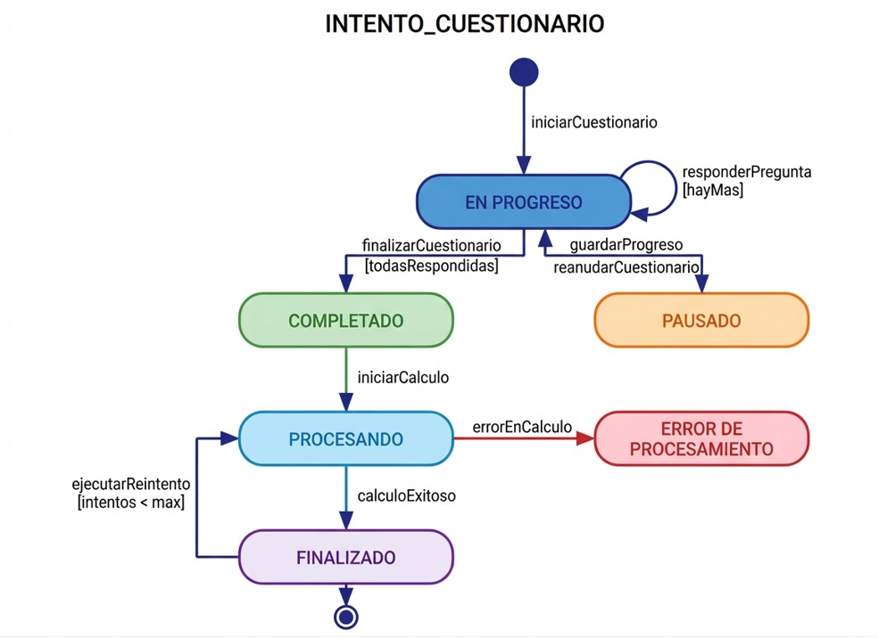

# Diagrama de Estados

1. Identificación de Estados Posibles
Basado en el análisis de los Requisitos Funcionales (RF-007, RF-008, RF-012) y los Casos de Uso (CU07, CU08, CU12), he identificado los siguientes estados para un INTENTO_CUESTIONARIO:

En Progreso: El estado inicial activo. El estudiante ha comenzado el cuestionario y está respondiendo preguntas, pero aún no ha terminado.
Pausado: El estudiante decidió interrumpir la sesión y guardar su progreso para continuar más tarde (específico del CU08).
Completado: El estudiante ha respondido todas las preguntas y ha confirmado el envío. El intento está cerrado desde la perspectiva del usuario, pero el sistema aún no ha calculado los resultados.
Procesando: El sistema (el motor de procesamiento vocacional) está calculando actualmente las afinidades y generando el perfil basado en las respuestas.
Error de Procesamiento: Ocurrió un fallo técnico durante el cálculo de resultados (ej. timeout de base de datos, error del motor). Según los casos de uso, este estado es transitorio pues el sistema intentará recuperarse.
Finalizado: El estado terminal exitoso. Los resultados se han calculado correctamente y la retroalimentación está disponible para ser consultada.

2. Justificación de Estados
En Progreso: Justificado por RF-007 (Presentación del cuestionario) y el flujo principal de CU07. Es necesario saber que un estudiante está activamente involucrado en una prueba.
Pausado: Justificado explícitamente por RF-008 (Guardado de progreso parcial) y CU08. Es crucial diferenciar entre alguien que abandonó el cuestionario y alguien que guardó intencionalmente para volver.
Completado: Justificado por CU07 (Paso 5: finaliza y confirma envío). Es un estado intermedio necesario que indica que el usuario ya cumplió su parte, separando la acción del usuario de la acción del sistema.
Procesando: Justificado por RF-012 (Generación automática) y CU12 (Excepción 2b: "La retroalimentación aún está siendo procesada"). El cálculo puede no ser inmediato.
Finalizado: Justificado por RF-012 y CU12. Es el estado meta donde el valor del negocio (el perfil vocacional) se ha entregado.
Error de Procesamiento: Justificado por las excepciones de CU07 (6a) y CU12 (2a). El sistema debe ser resiliente y manejar fallos en el motor de cálculo sin perder los datos del estudiante.