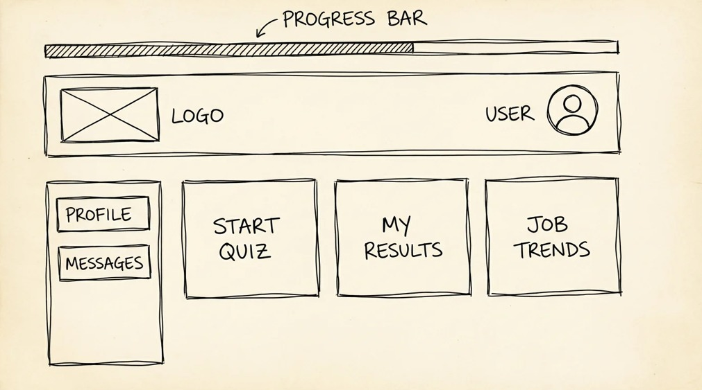

# Wireframes

1. Panel del Estudiante (Dashboard Principal)
Rol: Estudiante (Grado 10 y 11).

Elementos estructurales:
Header: Logo "Mi Camino", nombre del estudiante y botón de cerrar sesión.
Contenido Principal: Tres tarjetas grandes de acceso rápido: "Realizar/Continuar Cuestionario", "Ver Mis Resultados" y "Explorar Tendencias Laborales".
Barra de Progreso: Un indicador visual simple del estado del cuestionario (RIE-06).
Sección de Notificaciones: Espacio para mensajes del orientador.
Disposición general: Diseño de rejilla simple (cards) centrado para facilitar el toque en dispositivos móviles.
Acciones: Iniciar cuestionario, ver resultados previos, acceder al perfil para editar datos (RIE-03).

  

2. Cuestionario Vocacional Interactivo (RIE-06)
Rol: Estudiante.

Elementos estructurales:
Header: Título de la sección y botón "Guardar y Salir" (RIE-07).
Contenido Principal: Una pregunta por pantalla para evitar sobrecarga cognitiva.
Opciones de Respuesta: Botones grandes de selección única (radio buttons) o escala de Likert (1-5).
Navegación: Botones "Anterior" y "Siguiente" en la parte inferior.
Indicador de Progreso: Barra superior que muestra el porcentaje completado.
Disposición general: Diseño centrado en una sola columna, optimizado para lectura rápida en smartphones (RIE-17).
Acciones: Seleccionar respuesta, avanzar/retroceder, guardar progreso parcial.

  

3. Mis Resultados (Resumen Gráfico) (RIE-10)
Rol: Estudiante / Padre de Familia.

Elementos estructurales:
Header: Título "Perfil Vocacional" y botón de descarga (PDF).
Contenido Principal: Un gráfico de barras o radar (representado por formas geométricas simples) que muestra las áreas de mayor afinidad (Ingeniería, Artes, Salud, etc.).
Sección de Carreras Sugeridas: Lista de 3 a 5 tarjetas con el nombre de la carrera y un botón "Ver Detalle".
Footer: Enlace a "Tendencias Laborales" (RIE-13).
Disposición general: Gráfico en la parte superior (foco visual) y lista detallada debajo.
Acciones: Explorar carreras sugeridas, descargar reporte, ver explicación de resultados (RIE-12).

  

4. Panel del Orientador (Gestión de Estudiantes) (RIE-04)
Rol: Orientador Escolar.

Elementos estructurales:
Header: Logo, nombre del orientador y selector de institución.
Contenido Principal: Tabla de estudiantes con columnas: Nombre, Grado, Estado del Cuestionario (Completado/En Progreso), Fecha de Última Actividad.
Filtros: Barra de búsqueda por nombre y filtro por grado (10mo/11vo).
Acciones por Fila: Botón "Ver Resultados" y "Enviar Mensaje".
Disposición general: Diseño de tabla ancha para escritorio, con scroll lateral para dispositivos móviles (RIE-17).
Acciones: Buscar estudiante, filtrar lista, descargar reporte grupal (Módulo 5).